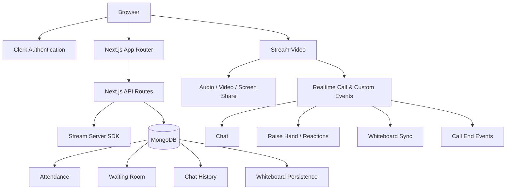

# Cohiva

**A real-time classroom and video collaboration platform inspired by Zoom and Google Meet, built with Next.js, Stream Video, Clerk, MongoDB, and Excalidraw.**

Cohiva is designed for live online classes and collaborative meetings where a host can manage participants, control classroom permissions, run a shared whiteboard, track attendance, record sessions, enable captions, and enforce meeting duration and capacity limits.

> **Current product limits:** up to **20 participants** per room and up to **45 minutes** per meeting.

---

## Why Cohiva

Cohiva is not only a video-call UI. It combines realtime media, classroom moderation, persistence, access control, collaboration tools, and performance-conscious frontend architecture in one application.

The project demonstrates practical work across:

- realtime audio/video systems
- role-based meeting permissions
- server-side validation
- MongoDB persistence
- authentication and protected routes
- realtime events and polling fallback
- collaborative whiteboard synchronization
- accessibility features
- responsive UI design
- production-oriented performance optimization
- error handling and regression-safe feature development

---

## Highlights for Developers & Recruiters

### Full-stack ownership

Cohiva includes both client-facing meeting UX and backend/API logic. The project covers:

- authenticated meeting creation
- privileged server-side Stream operations
- MongoDB models and API routes
- frontend state synchronization
- realtime classroom events
- route protection
- meeting capacity and duration enforcement
- moderation and access control
- responsive meeting UI

### Realtime systems

The app uses **Stream Video** for media transport and realtime call state instead of routing camera/audio traffic through the Next.js server.

Realtime flows include:

- video and audio
- screen sharing
- participant presence
- raise hand
- reactions
- chat delivery
- meeting end events
- whiteboard synchronization
- recording events
- captions

### Production-minded architecture

Several implementation choices are deliberately designed for deployment rather than only demo behavior:

- meeting limits are validated on the server
- hard limits are enforced by Stream
- privileged API operations use server-side credentials
- Stream Video SDK is scoped to authenticated meeting areas
- Excalidraw is lazy-loaded
- optional meeting panels are lazy-loaded
- MongoDB connections are reused across warm server runtimes
- polling is visibility-aware
- redundant/overlapping polling is avoided
- attendance records use deduplication and a unique participant index
- client permissions fail closed where appropriate

---

## Core Features

### Authentication & Protected Routing

- Clerk authentication
- sign-in and sign-up flows
- signed-out users are redirected to authentication
- authenticated meeting routes
- lightweight auth pages that avoid loading meeting SDKs unnecessarily

### Meeting Creation

- instant meetings
- scheduled meetings
- personal meeting rooms
- server-side meeting creation
- host-selectable meeting duration
- host-selectable participant capacity

### Meeting Limits

Hosts can configure:

- **Duration:** 1–45 minutes
- **Capacity:** 2–20 participants, including the host

Limits are validated server-side before being applied to the Stream call.

### Waiting Room & Access Modes

Meeting hosts can choose:

- **Open** — anyone with the meeting link can enter
- **Ask to join** — host approval required
- **Locked** — no new participants can enter

Waiting-room requests are persisted and surfaced to the host.

### Participant Moderation

Host controls include:

- mute/disable individual participant audio
- disable/allow individual camera
- disable/allow individual screen sharing
- remove participant
- pin/unpin participants
- class-wide permission controls

Bulk classroom controls include:

- **Mute all**
- **Cameras off**
- **Stop screen shares**

### Host Leave / End Meeting Behavior

If a participant leaves, only that participant exits.

If the host presses the leave button, Cohiva shows:

- **End the call for everyone**
- **Leave the room**
- **Cancel**

Global meeting termination is driven by Stream's `call.ended` event so all clients leave consistently.

### Chat

- realtime chat delivery
- persistent MongoDB history
- unread message badge
- popup notification when chat is closed
- reduced fallback polling because realtime events are primary

### Attendance

- participant join/leave tracking
- active-session tracking
- total attendance duration
- join count
- current presence state
- session history
- duplicate attendance prevention using `(callId, userId)` uniqueness
- defensive deduplication for legacy records

### Raise Hand & Reactions

Participants can:

- raise/lower hand
- send reactions

Host receives hand notifications and can view the raised-hand queue.

Supported reactions include:

`👍 👏 ❤️ 😂 🎉`

### Whiteboard

Powered by **Excalidraw**.

Features:

- realtime collaborative drawing
- pen
- highlighter
- eraser
- host clear-board control
- PNG export
- MongoDB persistence
- realtime sync using Stream custom events
- snapshot recovery
- permission-aware editing

Student whiteboard permission is intentionally **fail-closed** so a participant never receives temporary edit access while permission state is still being verified.

### Recording

- host-only recording controls
- start/stop recording
- recording status indicator
- recording-ready event handling
- recording-failed handling
- custom confirmation UI

### Captions & Accessibility

- live closed captions
- caption size controls
- high-contrast mode
- reduced-motion mode
- hide reactions
- keyboard shortcuts
- accessible status messaging

### Device Settings

Users can select:

- camera
- microphone
- speaker/output device where supported

If output-device switching is not supported by the browser, Cohiva falls back gracefully.

### Responsive Meeting Experience

Cohiva supports:

- desktop layouts
- tablet layouts
- mobile meeting lobby
- mobile meeting header behavior
- responsive panels and controls

---

## Keyboard Shortcuts

| Shortcut | Action |
|---|---|
| `Alt + M` | Toggle microphone |
| `Alt + V` | Toggle camera |
| `Alt + C` | Open/close chat |
| `Alt + P` | Open/close participants |
| `Alt + H` | Raise/lower hand |
| `Alt + W` | Switch Video / Whiteboard |
| `Alt + A` | Accessibility settings |
| `Alt + D` | Device settings |

Shortcuts are ignored while typing in text inputs, textareas, or content-editable fields.

---

## Tech Stack

### Frontend

- **Next.js 16**
- **React 19**
- **TypeScript**
- **Tailwind CSS**
- **shadcn/ui**
- **Lucide React**
- **Excalidraw**

### Realtime / Video

- **Stream Video React SDK**
- **Stream Node SDK**

### Authentication

- **Clerk**

### Backend

- **Next.js App Router API routes**
- **MongoDB**
- **Mongoose**

### Tooling

- ESLint
- PostCSS
- Turbopack / Next.js tooling

---

## Architecture



### Separation of responsibilities

**Stream Video**
- audio/video transport
- screen sharing
- call state
- participant state
- recording
- captions
- realtime custom events

**Next.js**
- protected pages
- server-side validation
- meeting creation
- privileged Stream operations
- application APIs

**MongoDB**
- attendance persistence
- waiting-room requests
- chat history
- whiteboard state

**Clerk**
- authentication
- user identity
- protected routes

---

## Project Structure

```text
cohiva/
├─ app/
│  ├─ (auth)/
│  │  ├─ sign-in/
│  │  ├─ sign-up/
│  │  └─ layout.tsx
│  │
│  ├─ (meeting)/
│  │  ├─ meeting/[id]/page.tsx
│  │  └─ layout.tsx
│  │
│  ├─ (root)/
│  │  ├─ personal-room/
│  │  ├─ previous/
│  │  ├─ recordings/
│  │  ├─ upcoming/
│  │  └─ page.tsx
│  │
│  ├─ api/
│  │  ├─ meetings/
│  │  │  ├─ access/
│  │  │  ├─ attendance/
│  │  │  ├─ chat/
│  │  │  ├─ classroom-event/
│  │  │  ├─ create/
│  │  │  ├─ join-request/
│  │  │  ├─ limits/
│  │  │  ├─ member/
│  │  │  ├─ whiteboard-event/
│  │  │  └─ whiteboard-state/
│  │  └─ stream-token/
│  │
│  ├─ globals.css
│  └─ layout.tsx
│
├─ components/
│  ├─ auth/
│  ├─ meeting/
│  │  ├─ CohivaLeaveCallControl.tsx
│  │  ├─ CohivaParticipantViewUI.tsx
│  │  ├─ CohivaRecordingControl.tsx
│  │  ├─ CohivaWhiteboard.tsx
│  │  ├─ MeetingAccessibilityPanel.tsx
│  │  ├─ MeetingAccessSettings.tsx
│  │  ├─ MeetingAttendancePanel.tsx
│  │  ├─ MeetingCaptionsOverlay.tsx
│  │  ├─ MeetingChatPanel.tsx
│  │  ├─ MeetingDeviceSettings.tsx
│  │  ├─ MeetingJoinRequests.tsx
│  │  ├─ MeetingLimitsSettings.tsx
│  │  ├─ MeetingParticipantsPanel.tsx
│  │  ├─ MeetingPermissionsPanel.tsx
│  │  ├─ MeetingRoom.tsx
│  │  ├─ MeetingSessionTimer.tsx
│  │  ├─ WhiteboardCanvas.tsx
│  │  └─ ...
│  └─ providers/
│     └─ StreamVideoProvider.tsx
│
├─ lib/
│  ├─ cohivaMeetingConfig.ts
│  ├─ mongodb.ts
│  ├─ streamServer.ts
│  ├─ useSmartPolling.ts
│  └─ ...
│
├─ models/
│  ├─ MeetingAccessConfig.ts
│  ├─ MeetingAttendance.ts
│  ├─ MeetingChatMessage.ts
│  ├─ MeetingJoinRequest.ts
│  └─ WhiteboardState.ts
│
├─ public/
├─ proxy.ts
├─ next.config.ts
├─ package.json
└─ tsconfig.json
```

---

## Key Engineering Decisions

### 1. Media does not pass through the application server

Cohiva relies on Stream's video infrastructure for media delivery. This keeps the Next.js backend focused on application logic instead of becoming a video relay.

### 2. Hard limits are server-controlled

Meeting duration and participant limits are not trusted from the browser alone.

The backend validates and clamps values before applying them to the Stream call.

### 3. Realtime first, persistence second

For chat and whiteboard interactions:

```text
Realtime event -> immediate UI
Database        -> durable state
```

MongoDB is not used as the primary realtime transport.

### 4. Fail-closed permissions

Whiteboard permission state is deliberately conservative.

Until permission is verified, a student remains in view-only mode.

### 5. Lazy-load heavy meeting features

Heavy/optional UI is loaded only when needed:

- Excalidraw
- participants
- chat
- attendance
- accessibility
- waiting room
- settings panels

### 6. Visibility-aware polling

Polling pauses or slows while the browser tab is hidden and avoids overlapping requests.

This reduces unnecessary backend traffic during active video meetings.

---

## Performance Work

The application has already undergone a dedicated optimization pass.

Implemented improvements include:

- lazy-loaded meeting panels
- lazy/conditional Excalidraw initialization
- optimized image assets
- Stream SDK CSS scoped to meeting routes
- reduced unnecessary global CSS
- reduced font loading
- MongoDB connection reuse
- field projections and lean queries
- indexed attendance/join-request lookups
- visibility-aware polling
- lower fallback polling frequency
- token reuse/caching for Stream reconnects
- reduced whiteboard event/write frequency
- responsive meeting layout optimization

A final Lighthouse/Core Web Vitals pass is planned after the functionality set is frozen.

---

## Data Model Example: Attendance

Attendance is tracked per meeting and per user.

Conceptually:

```ts
{
  callId,
  userId,
  name,
  image,
  firstJoinedAt,
  lastJoinedAt,
  lastLeftAt,
  activeSessionStartedAt,
  lastHeartbeatAt,
  totalSeconds,
  joinCount,
  isPresent,
  sessions: [
    {
      joinedAt,
      leftAt,
      durationSeconds
    }
  ]
}
```

A unique compound index prevents duplicate logical attendance records:

```ts
{ callId: 1, userId: 1 }
```

---

## Important Realtime Event Concepts

Cohiva uses custom Stream events for application-specific behavior.

Examples include:

```text
cohiva-chat
cohiva-classroom
cohiva-whiteboard
```

Custom call data includes values such as:

```text
cohiva_access_mode
cohiva_permissions
cohiva_individual_permissions
cohiva_duration_minutes
cohiva_max_participants
```

---

## Local Setup

### 1. Clone the repository

```bash
git clone <your-repository-url>
cd cohiva
```

### 2. Install dependencies

```bash
npm install
```

or:

```bash
npm ci
```

### 3. Create `.env.local`

```env
NEXT_PUBLIC_CLERK_PUBLISHABLE_KEY=your_clerk_publishable_key
CLERK_SECRET_KEY=your_clerk_secret_key

NEXT_PUBLIC_STREAM_API_KEY=your_stream_api_key
STREAM_API_SECRET=your_stream_secret

MONGODB_URI=your_mongodb_connection_string
```

> Never commit `.env.local` or production secrets.

### 4. Run development mode

```bash
npm run dev
```

Open:

```text
http://localhost:3000
```

### 5. Production build

```bash
npm run build
npm start
```

---

## External Service Setup

### Clerk

Create a Clerk application and configure the project with the publishable and secret keys.

### Stream

Create a Stream Video application.

For development, Cohiva can use the Stream built-in `default` call type.

For production, the intended configuration is a dedicated:

```text
cohiva_classroom
```

call type with a restricted host/participant capability matrix.

### MongoDB Atlas

Create a database and configure:

- database user
- connection URI
- Network Access allowlist

If attendance, waiting-room, chat persistence, and whiteboard persistence all fail at the same time with connection timeouts, verify MongoDB Atlas connectivity before debugging each feature separately.

---

## Current Development Status

### Implemented

- authentication
- protected routing
- instant meetings
- scheduled meetings
- personal room
- host-configurable duration
- host-configurable room capacity
- meeting timer
- waiting room
- open/approval/locked access
- participant moderation
- bulk host classroom controls
- chat
- attendance
- raise hand
- reactions
- whiteboard
- recording
- captions
- accessibility
- device selection
- responsive meeting UI
- host leave/end popup
- global End Class behavior
- mobile lobby
- frontend/backend optimization pass

### Planned / Finalization Work

- production Stream `cohiva_classroom` call type
- co-host / transfer-host support
- network/reconnection status UI
- picture-in-picture / optional background effects
- replace remaining native browser confirm dialogs
- rate limiting / abuse protection
- final load testing
- final Lighthouse/Core Web Vitals optimization
- deployment monitoring and observability

---

## Notable Problems Solved

This project includes several non-trivial bug fixes that are useful examples of production debugging:

### Whiteboard stale-permission race

A student could briefly regain editing capability after reopening the board because stale permission state was rendered before the async refresh completed.

**Fix:** permission state is reset before paint and editing is enabled only after explicit verification.

### Duplicate attendance records

The same participant could appear more than once.

**Fix:** unique database identity, API deduplication, and defensive response normalization.

### Global meeting end consistency

Using the wrong Stream event caused unexpected disconnect behavior.

**Fix:** Cohiva now uses the authoritative `call.ended` event for global meeting termination.

### Missing meeting controls

The Stream meeting stylesheet was accidentally absent from the scoped meeting route, causing controls/layout to render incorrectly.

**Fix:** SDK styles are loaded specifically in the meeting route layout.

### Mobile lobby clipping

The camera preview collapsed on mobile because of layout/absolute-positioning behavior.

**Fix:** explicit responsive preview sizing and natural mobile scrolling.

### Stream scheduled-call type mismatch

The server SDK expected a JavaScript `Date` for `starts_at`, not an ISO string.

**Fix:** scheduled calls now use the correct typed value.

---

## Security Considerations

Cohiva follows several important security practices:

- protected API routes validate authentication
- server-only credentials stay on the server
- meeting settings are validated server-side
- host-only operations are not trusted from frontend flags alone
- participant permissions are enforced through Stream capabilities where possible
- MongoDB credentials are never exposed to the browser
- production call roles should follow least privilege
- ended-call re-entry should be disabled for production

Before public deployment, rate limiting and additional abuse protection should be added to write-heavy endpoints.

---

## Testing Strategy

Meeting changes should be tested with at least two users:

```text
Host browser/account
+
Student browser/account
```

Regression coverage should include:

- create meeting
- waiting room
- join/deny/approve
- mic/camera
- screen share
- chat
- raise hand
- reactions
- participant moderation
- bulk host actions
- whiteboard permission
- whiteboard realtime sync
- attendance
- recording
- captions
- device settings
- host leave
- end for everyone
- meeting timer expiry
- participant capacity
- mobile UI

Always run:

```bash
npm run build
```

before accepting a major patch.

---

## Roadmap

```text
Current
  |
  +--> Network/reconnection UX
  |
  +--> Production Stream call roles
  |
  +--> Co-host / host transfer
  |
  +--> Rate limiting & deployment hardening
  |
  +--> Load testing up to 20 participants
  |
  +--> Final performance pass
  |
  +--> Production deployment
```

---

## What This Project Demonstrates

For engineering reviewers and recruiters, Cohiva demonstrates experience with:

- full-stack TypeScript
- modern Next.js architecture
- realtime WebRTC/SFU-backed applications
- external SDK integration
- API design
- authentication
- server-side authorization
- MongoDB/Mongoose
- realtime event synchronization
- collaborative state
- race-condition debugging
- frontend performance
- responsive UI
- accessibility
- production-oriented testing and hardening

It also demonstrates the ability to evolve a complex application without repeatedly rewriting the architecture: features were added incrementally while preserving existing realtime behaviors.

---

## Screenshots / Demo

Add your latest screenshots here before publishing the repository:

```md


```

A short demo video or deployed URL is highly recommended for portfolio/recruiter review.

---

## License

Add the license you want to use for this repository.

For example:

```text
MIT License
```

---

## Author

Add your preferred public details:

```text
Name: Your Name
Portfolio: https://your-portfolio.example
LinkedIn: https://linkedin.com/in/your-profile
GitHub: https://github.com/your-username
```

---

<p align="center">
  Built as a full-stack realtime collaboration project with Next.js, Stream Video, Clerk, MongoDB, and Excalidraw.
</p>
